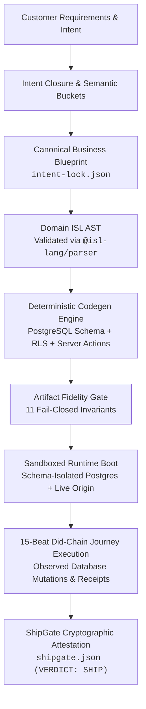

<div align="center">

# `WholeStack`
### Deterministic Software Manufacturing Engine

**"We ship proof, not code. The product is the contract plus the attestation. The application is the byproduct."**

[](https://wholestack.ai)
[](https://github.com/WholestackAI/volition-proof)
[](#-the-manufacturing-spine)
[](#)

</div>

---

### 🌐 The Thesis

Consumer "vibe-coding" builders emit unstructured code with no contract, no invariants, and no proof. They cannot verify tenant isolation, and they cannot guarantee that a generated application won't silently fail in production.

**WholeStack is the deterministic software manufacturing engine.**
Every system gets a contract. Every change gets proof. Every action gets an authority decision. WholeStack keeps the record.



---

### 🏛️ The Three Pillars on One Spine

```
┌─────────────────────────────────────────────────────────────────────────────┐
│ 1. WHOLESTACK   │ THE DETERMINISTIC MANUFACTURING ENGINE                    │
│                 │ Transforms natural language requirements into validated,  │
│                 │ multi-tenant business applications. Zero probabilistic    │
│                 │ guessing inside the compiler lowering.                    │
├─────────────────┼───────────────────────────────────────────────────────────┤
│ 2. VOLITION     │ THE AGENT AUTHORITY OS                                    │
│                 │ Mediates autonomous agent actions against sealed contracts│
│                 │ "Agents decide what they want to do.                      │
│                 │  Volition decides what they have the authority to do."    │
├─────────────────┼───────────────────────────────────────────────────────────┤
│ 3. SHIPGATE     │ INDEPENDENT RUNTIME ATTESTATION                           │
│                 │ 11 static fidelity invariants, adversarial anti-stub      │
│                 │ scanning, and 15-beat customer did-chain verification.    │
└─────────────────────────────────────────────────────────────────────────────┘
```

---

### ⚖️ The Prime Laws

> **"No intelligence is considered real until the production artifact consumes it, and no behavior is considered proven until the generated application executes it."**

1. **Deterministic Lowering**: Where the compiler has a lowering rule, ISL $\rightarrow$ application code is 100% deterministic. LLMs never touch compiler lowering at build time.
2. **Fail-Closed Integrity**: If an application functions but violates tenant boundaries, it FAILS CLOSED. If an action does not mutate durable state, it is decorative.
3. **Proof Over Code**: We do not evaluate screenshots or raw tokens. We boot the application in schema-isolated sandboxes and execute live user journeys to record cryptographic receipts.

---

### 🔬 Public Evidence & Open Repositories

While the core WholeStack manufacturing factory remains proprietary, we publish open authority kernels, benchmark harnesses, and client toolchains:

| Repository | Focus | Highlights |
| :--- | :--- | :--- |
| **[`WholestackAI/isl`](https://github.com/WholestackAI/isl)** | Open Language Standard | Closed-world contract language, AST parser (`@isl-lang/parser`), typechecker (`@isl-lang/typechecker`), and formal specification (MIT). |
| **[`WholestackAI/volition-proof`](https://github.com/WholestackAI/volition-proof)** | Public Authority Kernel | Runnable Volition governor + 15-attack adversarial gauntlet. 19 ungoverned control breaches, 0 Volition breaches. |
| **[`WholestackAI/volition-releases`](https://github.com/WholestackAI/volition-releases)** | Desktop Client | Official Volition Hub installers for macOS and Windows. |

---

### 📖 Research & Documentation

* **[Deterministic Authority Research](https://wholestack.ai/research/deterministic-authority)**: How decoupled, non-self-modifiable governors prevent autonomous agent privilege escalation.
* **[The Authority Gauntlet Map](https://wholestack.ai/research/deterministic-authority/proof)**: Live evidence receipts across 18 model executors and adversarial defect classes.

---

<div align="center">

**[Platform](https://wholestack.ai)** • **[Research](https://wholestack.ai/research/deterministic-authority)** • **[Contact](mailto:support@wholestack.ai)**

*Build it. Prove it. Ship it.*

</div>
